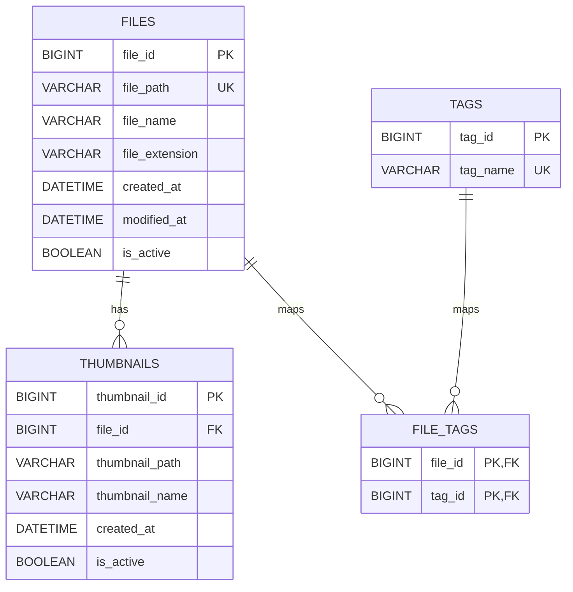

# RemoteDirectoryManager 데이터베이스 테이블 다이어그램

## 관련 문서

- 기능 요약: [`feature-list.md`](feature-list.md)
- 유저 플로우: [`user-flow-chart.md`](user-flow-chart.md)
- API 문서: [`api-documentation.md`](api-documentation.md)

## 문서 목적

- RemoteDirectoryManager 에서 사용하는 데이터베이스 테이블 구조를 시각적으로 설명한다.
- 어떤 데이터가 어디에 저장되는지, 어떤 테이블이 어떤 관계로 연결되는지 정리한다.
- 실제 파일 본문은 파일시스템에 저장되고, 이 문서는 메타데이터와 관계 데이터만 다룬다.

## 저장 구조 개요

- 데이터베이스 예시 이름: `RDM`
- 실제 파일/디렉터리 본문: 파일시스템 저장소 루트 아래 저장
- 파일 메타데이터: `files`
- 썸네일 메타데이터: `thumbnails`
- 태그 마스터: `tags`
- 파일-태그 연결: `file_tags`

## 1. ERD 다이어그램

## 2. 테이블별 설명

### 2.1 `files`

- 역할: 파일 메타데이터의 기준 테이블
- 저장 내용
  - 파일 상대 경로
  - 파일명
  - 확장자
  - 생성 시각
  - 수정 시각
  - 활성 여부
- 특징
  - `file_path` 는 유니크하다.
  - 실제 파일 내용은 저장하지 않는다.
  - 디렉터리는 이 테이블에 직접 저장하지 않는다.
  - 파일이 삭제되면 물리 삭제보다 `is_active = false` 로 비활성화되는 흐름을 사용한다.

### 2.2 `thumbnails`

- 역할: 파일에 연결된 썸네일 메타데이터 저장
- 저장 내용
  - 어떤 파일의 썸네일인지(`file_id`)
  - 썸네일 경로
  - 썸네일 파일명
  - 생성 시각
  - 활성 여부
- 특징
  - 하나의 파일은 여러 썸네일을 가질 수 있다.
  - `files.file_id` 를 참조한다.
  - 부모 파일 삭제 시 `ON DELETE CASCADE` 로 함께 제거된다.
- 비고
  - 현재 스키마에는 존재하지만, 현재 주요 기능 흐름에서는 적극적으로 사용되지 않는다.

### 2.3 `tags`

- 역할: 태그 마스터 데이터 저장
- 저장 내용
  - 태그 ID
  - 태그명
- 특징
  - `tag_name` 은 유니크하다.
  - 태그 자체는 독립적으로 저장되고, 실제 파일 연결은 `file_tags` 로 관리한다.

### 2.4 `file_tags`

- 역할: 파일과 태그의 다대다 관계 연결
- 저장 내용
  - 파일 ID
  - 태그 ID
- 특징
  - 복합 기본키는 `(file_id, tag_id)` 이다.
  - 하나의 파일에 여러 태그를 연결할 수 있다.
  - 하나의 태그를 여러 파일에 연결할 수 있다.
  - 부모 파일 또는 부모 태그 삭제 시 `ON DELETE CASCADE` 로 함께 제거된다.

## 3. 관계 설명

### `files` -> `thumbnails`

- 관계: 1:N
- 의미: 한 파일은 여러 썸네일 메타데이터를 가질 수 있다.

### `files` -> `file_tags`

- 관계: 1:N
- 의미: 한 파일은 여러 태그 연결 레코드를 가질 수 있다.

### `tags` -> `file_tags`

- 관계: 1:N
- 의미: 한 태그는 여러 파일 연결 레코드를 가질 수 있다.

### `files` <-> `tags`

- 관계: N:M
- 매개 테이블: `file_tags`
- 의미: 파일 하나에 여러 태그를 붙일 수 있고, 태그 하나를 여러 파일에 공유할 수 있다.

## 4. 데이터 저장 흐름

## 4.1 파일 업로드 시

1. 파일 본문은 먼저 대상 디렉터리의 임시 파일로 기록된다.
2. overwrite 상황이면 기존 파일은 백업 staging 이름으로 이동한다.
3. 새 파일이 실제 위치로 이동한 뒤 `files` 테이블 메타데이터 저장 또는 갱신이 시도된다.
4. DB 반영이 성공하면 staging 정리가 확정되고, 실패하면 파일시스템 변경이 복구된다.
5. 태그는 업로드만으로 자동 저장되지 않는다.

## 4.2 파일 상세 조회 시

1. 파일시스템 속성을 읽는다.
2. `files` 테이블 메타데이터를 최신 상태로 동기화할 수 있다.
3. 연결된 태그는 `file_tags` 와 `tags` 를 통해 함께 조회된다.

## 4.3 태그 추가 시

1. 기존 태그 ID가 전달되면 `tags` 에서 조회한다.
2. 새 태그명이 전달되면 `tags` 에 저장한다.
3. 파일과 태그 연결은 `file_tags` 에 저장된다.

## 4.4 삭제 시

1. 실제 파일/디렉터리는 바로 삭제되지 않고 먼저 staging 경로로 이동한다.
2. 관련 파일 메타데이터는 `files.is_active = false` 로 비활성화된다.
3. 트랜잭션 커밋이 성공하면 staging 대상이 실제 삭제된다.
4. DB 반영이 실패하면 staging 대상은 원래 경로로 복구된다.
5. 파일 레코드가 실제 삭제되는 구조는 아니며, 논리 삭제 방식에 가깝다.

## 5. 파일시스템과 DB의 역할 분리

| 구분 | 저장 위치 | 설명 |
|---|---|---|
| 파일 본문 | 파일시스템 | 실제 업로드 파일 데이터 |
| 디렉터리 구조 | 파일시스템 | 실제 폴더 구조 |
| 파일 메타데이터 | `files` | 파일 경로, 이름, 확장자, 시각, 활성 여부 |
| 썸네일 메타데이터 | `thumbnails` | 썸네일 경로 및 파일 연결 정보 |
| 태그 마스터 | `tags` | 전체 태그 정의 |
| 파일-태그 연결 | `file_tags` | 파일과 태그의 다대다 관계 |

## 6. 설계상 참고 사항

- 이 서비스는 파일시스템 우선 구조이다.
- DB는 파일 자체를 저장하지 않고 메타데이터와 부가 관계만 관리한다.
- 디렉터리는 DB 테이블로 관리하지 않고 실시간 파일시스템 조회 결과로 다룬다.
- 삭제된 파일 메타데이터는 즉시 제거하기보다 비활성화 상태로 남길 수 있다.
- 향후 썸네일 생성 기능이 확장되면 `thumbnails` 테이블 활용도가 높아질 수 있다.
