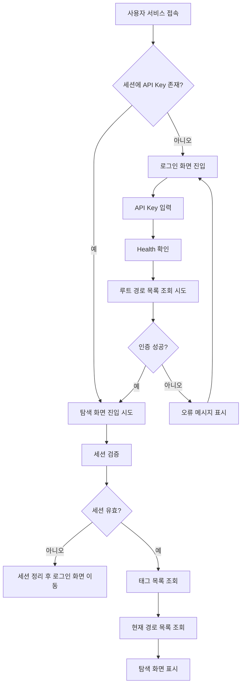
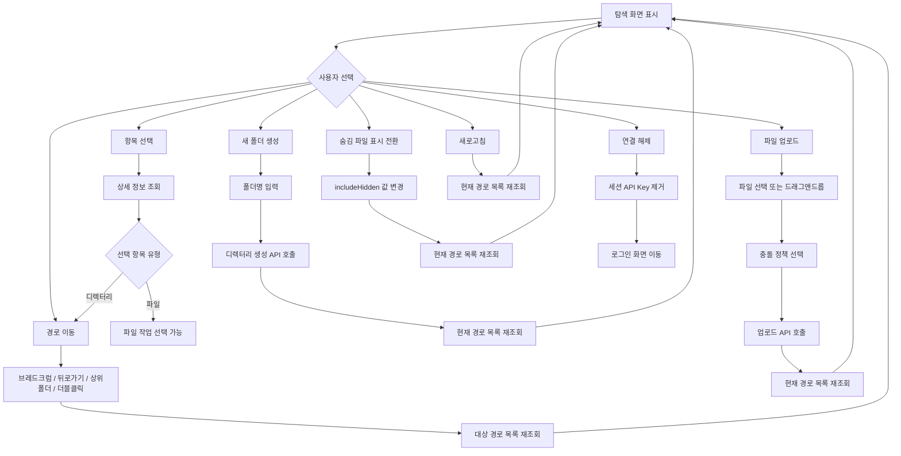
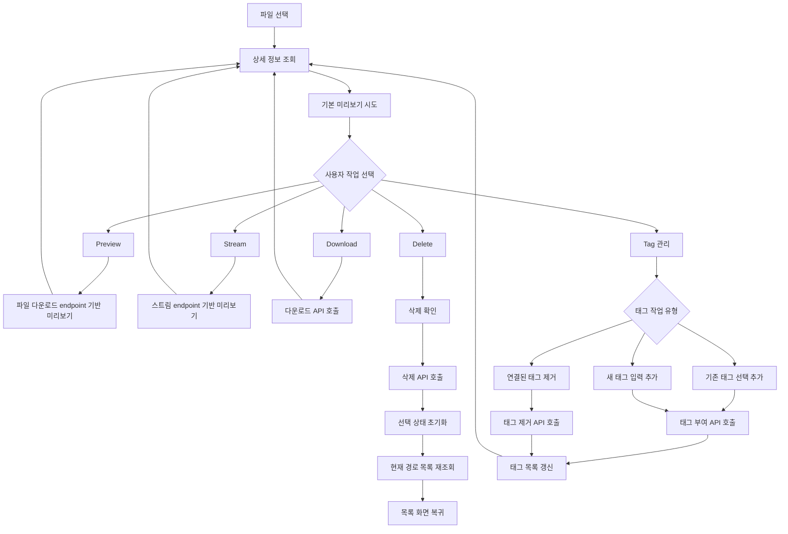
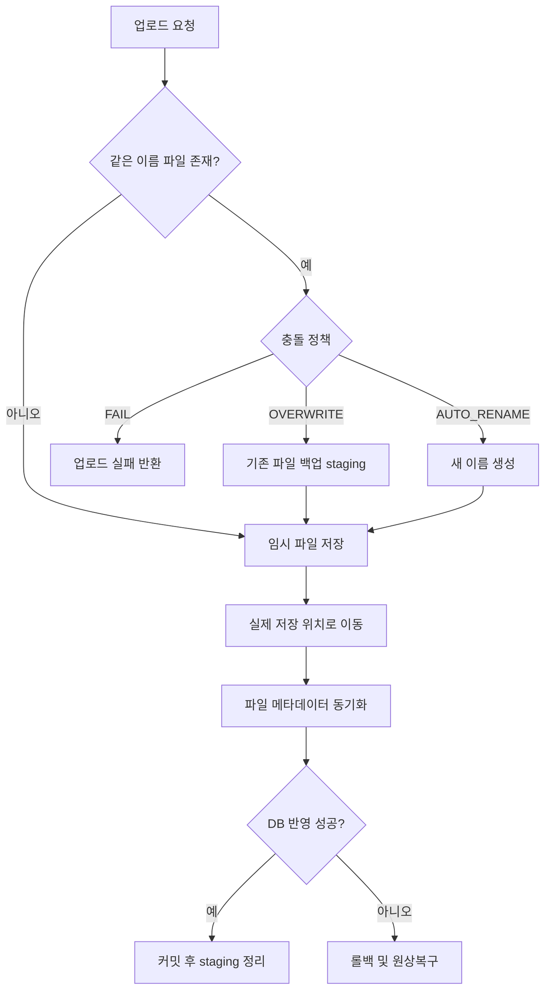
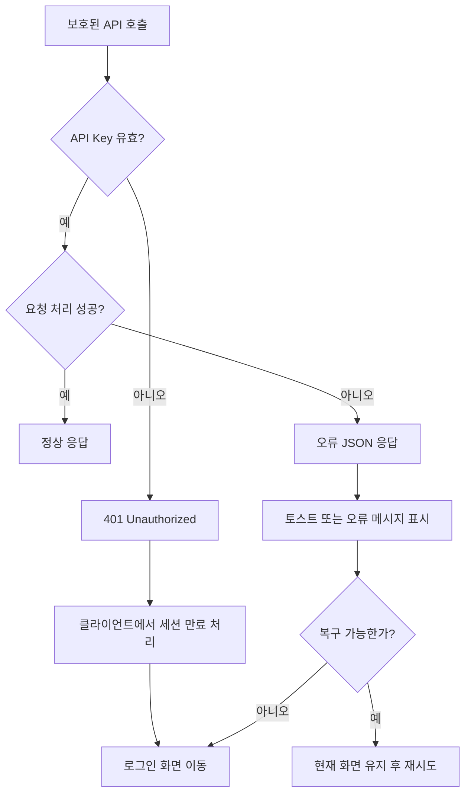

# RemoteDirectoryManager 유저 플로우 차트

## 관련 문서

- 서비스 개요: [`../README.md`](../README.md)
- 기능 요약: [`feature-list.md`](feature-list.md)
- API 문서: [`api-documentation.md`](api-documentation.md)
- DB 구조: [`database-table-diagram.md`](database-table-diagram.md)

## 문서 목적

- 원격파일메니저 서비스에서 사용자가 어떤 화면과 기능을 거쳐 이동하는지 한눈에 확인하기 위한 문서이다.
- 로그인, 탐색, 파일 작업, 태그 작업, 예외 흐름을 시각적으로 보여준다.
- 다이어그램은 Mermaid 지원 Markdown 뷰어 기준으로 작성되었다.

## 1. 전체 서비스 진입 플로우

## 2. 탐색 화면 메인 플로우

## 3. 파일 선택 후 상세 작업 플로우

## 4. 업로드 충돌 처리 플로우

## 5. 예외 및 인증 실패 흐름

## 6. 화면별 선택 가능 기능 요약

- 로그인 화면
  - API Key 입력
  - 연결 시도

- 탐색 화면 공통
  - 브레드크럼 이동
  - 뒤로가기
  - 상위 폴더 이동
  - 새로고침
  - 숨김 파일 표시 전환
  - 테마 전환
  - 연결 해제

- 디렉터리 선택 시
  - 열기
  - 더블클릭 이동
  - 하위 항목 탐색
  - 현재 경로 기준 업로드
  - 현재 경로 기준 새 폴더 생성

- 파일 선택 시
  - 상세 정보 보기
  - Preview
  - Stream
  - Download
  - Delete
  - 태그 추가
  - 태그 제거
